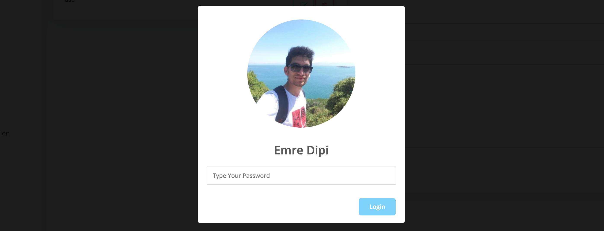

# isAuth


This package provides control to check if user session dead before submit forms. If the session is dead, a modal will reveal and ask password to re-login.



### [Demo](http://isauth.herokuapp.com/)
### [Demo Source](https://github.com/spiderwebtr/isAuthDemo)


## 1- Installation
Require this package with composer.

```shell
composer require spiderwebtr/isauth
```

### 1.2- Laravel < 5.5
If you don't use auto-discovery, add the ServiceProvider to the providers array in config/app.php

```php
spiderwebtr\isauth\isAuthServiceProvider::class,
```

### 2- Create assets and config file
Run the command to create the js and config files.

```bash
php artisan vendor:publish --provider="spiderwebtr\isauth\isAuthServiceProvider" --force --tag="public" --tag="config"
```

### 3- Edit config/isAuth.php
Under config folder, you'll see [`isAuth`](src/config/isAuth.php) config file. Edit the fields for customizations.

```php
return [
    "middleware"=>['web'], //for laravel routes (web,api...)
    "options"=>[
        "loginField"=>"email", //If your project uses username to login, change it with "username".
        "texts"=>[ //translate
            "placeholder"=>"Type Your Password",
            "wrong"=>"Wrong Password",
            "error"=>"Error",
            "button"=>"Login"
        ]
    ],
];
```

### 4- Include JQuery,Sweet Alert and @isAuthAssets in your footer
You can download the js files or just use cdn. `@isAuthAssets` will call isAuth.js and define auth object with your config.

```html
<script src="https://ajax.googleapis.com/ajax/libs/jquery/3.4.1/jquery.min.js"></script>
<script src="https://unpkg.com/sweetalert/dist/sweetalert.min.js"></script>
@isAuthAssets([
    "user"=>auth()->user(),
    "photo"=>$user->avatar //(not required) if you use avatar in your user system, pass the url of your user's avatar to "photo" key, if you don't use avatar, you can remove the key in array
])
```

## Extras
### :fire: isAuth function
`isAuth` function takes a callback parameter so in your code you can call `isAuth` to check the session before doing your js stuff.

```javascript
auth.isAuth(function(){
    //do something 
});
```
Login modal will reveal if the session is dead. When you re-login, your code will work with callback.

### Contributors
* [@emredipi](https://github.com/emredipi)
* [@jasonhoule](https://github.com/jasonhoule)
* You can be here :)

### Feedback
If you give me some feedback I will be happy. You can show your satisfaction with star. :star:

### Update Guide
- **v1.1** - If you downloaded the package in development version (dev-master), please remove it apply Installation Guide from this readme file (require,Create assets,Last Step).
- **v1.2** - Delete the js codes in footer, then start from step 2

